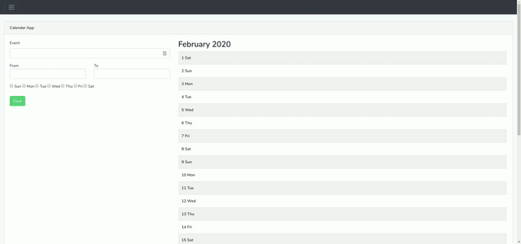

# Appetiser Coding Challenge


Create a simple web app, using Laravel, that can add events (no need for edit and delete) to a calendar as shown in the [video](http://178.128.212.62/v.mp4). Save the event to a MySQL table. The app needs to be on a single page. You may use any javascript framework and css framework.

When done, push your codes to a Github repository and send us the link. Pull and setup the code to an online server. If you do not have an online server, we can provide you with one.

## Requirements
- AMPPS, WAMP, XAMPP or MAMP (Optional)
- Homestead (Recommended)
- Composer 1.9.0
- PHP 7.3.13

## Getting started
- Copy `.env.example` to `.env`
- Run `composer install` or `php composer.phar install` to install required packages
- Run `php artisan key:generate` to create application key
- Run `npm install` to install npm packages
- Run `npm run dev` or `npm run prod` to compile assets
- Run `npm run watch` to automaticaly build and update the changes

## Setup Environment
You can choose environment setup whether Local Web Server (AMPPS, WAMP, XAMPP or MAMP) or Homestead.

### Setup Local Web Server
#### Download
- [AMPPS](https://www.ampps.com/download)
- [WAMP](http://www.wampserver.com/en/)
- [XAMPP](https://www.apachefriends.org/download.html)
- [MAMP](https://www.mamp.info/en/downloads/)

#### Start Services
- Start Apache and MySQL

#### Setup Database
- Go to your phpMyAdmin
- Create `appetiser_coding_challenge` database
- Run `php artisan migrate` to execute outstanding migrations
---

### Setup Homestead
#### Download
- [VirtualBox 5.2.12](https://www.virtualbox.org/wiki/Downloads)
- [Vagrant 2.1.2](https://www.vagrantup.com/downloads.html)

#### Reference how to set up homestead
Follow the link https://laravel.com/docs/6.x/homestead to set up homestead

#### The Hosts File
You must add the "domains" for your Nginx sites to the hosts file on your machine. The hosts file will redirect requests for your Homestead sites into your Homestead machine. On Mac and Linux, this file is located at /etc/hosts. On Windows, it is located at  C:\Windows\System32\drivers\etc\hosts. The lines you add to this file will look like the following:
```console
192.168.10.10  dev.appetiser-coding-challenge.com
```

#### Launching The Vagrant Box
Once you have edited the Homestead.yaml to your liking, run these command from your Homestead directory:
```console
$ vagrant up
```

#### Access MySQL on Vagrant Box
```console
$ vagrant ssh
$ Mysql
$ show database;
$ use appetiser_coding_challenge
```
